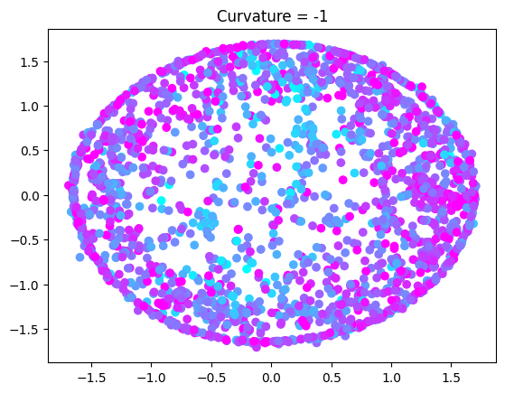
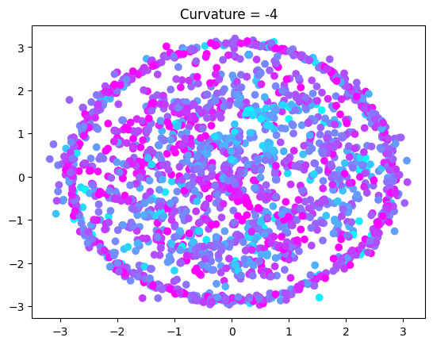

Use Descriptors over Fingerprints: https://www.ncbi.nlm.nih.gov/pmc/articles/PMC9320518/

target_cols = ['Fish', 'Flower', 'Fruit', 'Spices', 'Sweaty', 'Wood', 'Pleasantness'] 
Acc = output within 10% of target 
Most go to 0.1 acc 
Fruit goes to 0.06 
Spices goes to 0.15 
Pleasantness goes to 0.3/0.35 

1 model VS many:
    Many can use different descriptors as input, but probably not useful as we can just pass the first 93 columns to get .99 of variance.
    Many gives more clarity to what odors are easier and harder to predict.
    1 is simpler/easier.

Use spacy web_lg model to get similar columns in arc to those in keller
Arc says 126 = woody, Keller says 126[Wood] = 0.7%, highest are Sweet(15%), Chemical(12%)
Made Keller binary by:
    First take most common columns from Keller and Arc (at least 1% occurence when combined, lowest is cold=3%)
        ['Chemical', 'Cold', 'Flower', 'Fruit', 'Garlic', 'Grass', 'Musky', 'Spices', 'Sweet', 'Wood']
    Then use keller > 8.95, as this gives the same percentage of ones as Arc (16.9%)

<h1>Euclidian Model</h1>
<h2>BCELoss()</h2>

<h2>BCEWithLogitsLoss(pos_weight=bce_positive_weights)</h2>
label_occurences = torch.tensor([0.137863, 0.035742, 0.498822, 0.352710, 0.104870, 0.251767, 0.111155, 0.065593, 0.147290, 0.148861]) 
adjusted_occurences = np.power((label_occurences / label_occurences.min()), 0.5) * label_occurences.min() 
bce_positive_weights = adjusted_occurences.min() / adjusted_occurences 
WEIGHT_SCALAR = 0.75 / label_occurences.max() 
bce_positive_weights = bce_positive_weights / bce_positive_weights.min() * WEIGHT_SCALAR 

<h1>Molecule Graph</h1>

<h2>Molecule Graph</h2>

    
    
    

<h1>Bad Mordred descriptors (arc_dataset.csv)</h1>

<!-- | Trad NN  | 0.058    | 0.320        | 0.610       | 0.445    | -->
<!-- | HypLL NN | 0.031    | 0.340        | 0.630       | 0.440    | -->
| Model                                                    | Accuracy | Hamming Loss | Sensitivity | F1 Score |
|----------------------------------------------------------|----------|--------------|-------------|----------|
| XGBoost                                                  | 0.240    | 0.189        | 0.394       | 0.478    |
| Trad NN                                                  | 0.161    | 0.251        | 0.539       | 0.484    |
| HypLL NN 1-threshold tuning (acc)                        | 0.155    | 0.256        | 0.514       | 0.467    |
| HypLL NN grid search                                     | 0.119    | 0.289        | 0.584       | 0.468    |
| HypLL NN grid search + 1-threshold tuning (acc)          | 0.210    | 0.218        | 0.352       | 0.410    |
| HypLL NN grid search + all-threshold tuning (occurences) | 0.146    | 0.250        | 0.449       | 0.440    |

<h1>Good Mordred descriptors (arc_red_zero.csv)</h1>

| Model    | Accuracy | Hamming Loss | Sensitivity | F1 Score |
|----------|----------|--------------|-------------|----------|
| XGBoost  | 0.269    | 0.179        | 0.419       | 0.506    |
| Trad NN quick by hand (t=0.7) | 0.205 | 0.221 | 0.550 | 0.521 |
| HypLL NN grid search (t=0.5) | 0.267 | 0.197 | 0.450 | 0.500 |
| HypLL NN grid search (t=0.7) | 0.273 | 0.187 | 0.368 | 0.462 |

| Model                        | Accuracy | Hamming Loss | Precision | Sensitivity | F1 Score | mAP   |
|------------------------------|----------|--------------|-----------|-------------|----------|-------|
| HypLL NN t_red (t=0.65) | 0.294    | 0.179        | 0.660     | 0.374       | 0.477    | 0.510 |
| HypLL NN t_all (t=0.6)  | 0.144    | 0.151        | 0.623     | 0.387       | 0.478    | 0.426 |

<h1>PaDEL descriptors and fingerprints (arc_PaDEL.csv)</h1>

| Model                | Accuracy | Hamming Loss | Precision | Sensitivity | F1 Score | mAP   |
|----------------------|----------|--------------|-----------|-------------|----------|-------|
| HypLL NN t_red 0.6   | 0.280    | 0.197        | 0.558     | 0.486       | 0.520    | 0.510 |
| HypLL NN t_red 0.65  | 0.276    | 0.185        | 0.620     | 0.390       | 0.479    | 0.510 |
| HypLL NN t_all       | 0.157    | 0.151        | 0.605     | 0.441       | 0.510    | 0.465 |

<h1>PaDEL + Mordred (arc_comb_red.csv)</h1>

| Model                | Accuracy | Hamming Loss | Precision | Sensitivity | F1 Score | mAP   |
|----------------------|----------|--------------|-----------|-------------|----------|-------|
| HypLL NN t_red f_all | 0.275    | 0.183        | 0.638     | 0.376       | 0.473    | 0.510 |
| HypLL NN t_red f_326 | 0.271    | 0.196        | 0.559     | 0.489       | 0.521    | 0.499 |
| HypLL NN t_all       | 0.170    | 0.141        | 0.675     | 0.410       | 0.510    | 0.476 |

<h1>Mass Spectra (arc_ms_spec.csv)</h1>

| Model                | Accuracy | Hamming Loss | Precision | Sensitivity | F1 Score | mAP   |
|----------------------|----------|--------------|-----------|-------------|----------|-------|
| Trad  NN t_red f_red | 0.172    | 0.238        | 0.441     | 0.371       | 0.402    | 0.356 |
| HypLL NN t_red f_all | 0.159    | 0.225        | 0.467     | 0.260       | 0.334    | 0.370 |
| HypLL NN t_red f_red | 0.174    | 0.247        | 0.422     | 0.386       | 0.403    | 0.376 |
| HypLL NN t_all f_red | 0.093    | 0.181        | 0.487     | 0.300       | 0.372    | 0.328 |

<h1>Mass Spectra Var Ordered (arc_ms_spec.csv)</h1>

| Model                | Accuracy | Hamming Loss | Precision | Sensitivity | F1 Score | mAP   |
|----------------------|----------|--------------|-----------|-------------|----------|-------|
| Trad  NN t_red f_194 | 0.170    | 0.234        | 0.450     | 0.358       | 0.400    | 0.358 |
| Trad  NN t_all f_194 | 0.097    | 0.172        | 0.540     | 0.295       | 0.381    | 0.329 |
| HypLL NN t_red f_194 | 0.182    | 0.222        | 0.477     | 0.326       | 0.387    | 0.394 |
| HypLL NN t_all f_194 | 0.115    | 0.177        | 0.510     | 0.329       | 0.400    | 0.341 |

<h1> STRAWBERRIES: </h1>
Predicting doing overall-liking (0-1):

| Model | MAE |
|-------|-----|
| XGBoost | 0.041961 |
| Euc NN 0X32 | 0.00103 |
| Hyp NN 1X64 | 0.00056 |

<h1> TOMATOS: </h1>
Predicting doing overall-liking (0-1):

| Model | MAE |
|-------|-----|
| XGBoost | 0.102072 |
| Euc NN | 0.00061 |
| Hyp NN | 0.00081 |

<h1> PLAN: </h1>
Hyperbolic Models need a fraction of the parameters to match  
the performance of Traditional NN Models for the strawberry data.  
Try the different ways to represent data to see if this holds in general.  
Implement something myself to get an 8 or higher,  
think of Self Attention or CNN in HypLL.  
